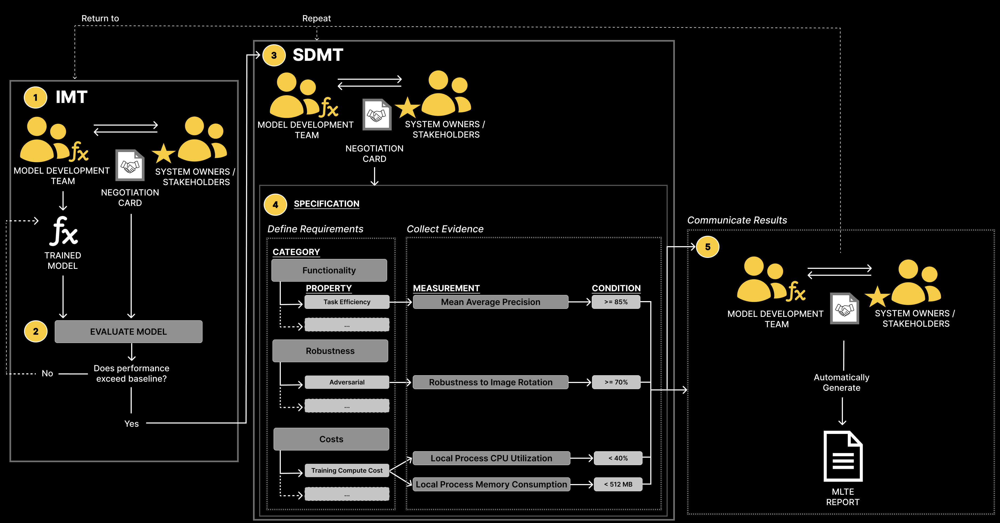

# Machine Learning Test and Evaluation (MLTE)


`MLTE` (pronounced "melt") is a process and a Python library that provides infrastructure for machine learning (ML) test and evaluation. `MLTE` enables teams to more effectively negotiate, document, and evaluate model and system qualities. 

## MLTE Process

*Diagram to be updated October 2024*

### Continuous Negotiation
To begin, model developers and project stakeholders meet to determine mission and system requirements that will influence model development such as the deployment environment, available data, model requirements, and system requirements. Throughout the process, teams continue to have meetings to update their assumptions and requirements.

#### MLTE Negotiation Card
As part of the negotiation, teams fill out a `MLTE` [negotiation card](negotiation_card.md) which allows them to record agreements and drives model development and testing.

#### Quality Attribute Scenarios
Quality attributes are a way to specify a system’s structural and behavioral requirements; MLTE leverages this approach during negotiations to help teams move from vague statements to concrete requirements.

### Initial Model Testing (IMT)
Teams use information from the [negotiation card](negotiation_card.md) during initial model development to inform model requirements and thresholds. Once initial development is complete, model teams do initial testing during this step to determine when the model exceeds their baselines.

### System Dependent Model Testing (SDMT)
Once a model passes its baseline requirements in IMT, teams can then focus on ensuring that it passes the larger set of system and model requirements. To do so, teams use system requirement and quality attribute information from the [negotiation card](negotiation_card.md) to develop a test specification, which contains code that will evaluate each model or system requirement.

#### Test Catalog
The `MLTE` Test Catalog contains reusable — local or organizational — examples of test cases organized by quality attribute. Model developers can use it to find examples of tests (like looking for code examples on StackOverflow).

#### Communicating Results
Once SDMT has provided evidence of how a model performs against required model and system qualities, a MLTE Report can be generated to communicate test results and provide the context for requirements and results.

If results are satisfactory, the output is a production-ready model (meaning that is meets defined system and model requirements), along with all testing evidence (code, data, and results). 

If results are not satisfactory, more negotiation is required to determine if requirements are realistic, whether more experimentation is required, or whether results triggered additional requirements or tests.

## Further Information

- [MLTE Process](mlte_process.md) (A more detailed guide than above)
- [Setting Up MLTE](setting_up_mlte.md)
- [Development](development.md)
- MLTE <a href="https://arxiv.org/abs/2303.01998" target="_blank">Paper</a> (ICSE 2023)

## MLTE Metadata

- Version: 0.3.0
- Contact Email: mlte dot team dot info at gmail dot com
- Citation: While not required, it is highly encouraged and greatly appreciated if you cite our paper when you use `MLTE` for academic research.

```
@article{maffey2023mlteing,
  title={MLTEing Models: Negotiating, Evaluating, and Documenting 
  Model and System Qualities},
  author={Maffey, Katherine R and Dotterrer, Kyle and Niemann, Jennifer 
  and Cruickshank, Iain and Lewis, Grace A and K{\"a}stner, Christian},
  journal={arXiv preprint arXiv:2303.01998},
  year={2023}
}
```

## Check out `MLTE` on <a href="https://github.com/mlte-team/mlte" target="_blank">GitHub</a>!