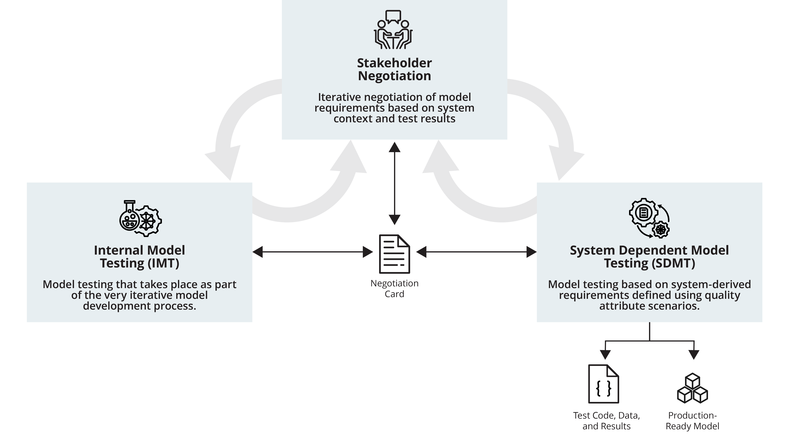
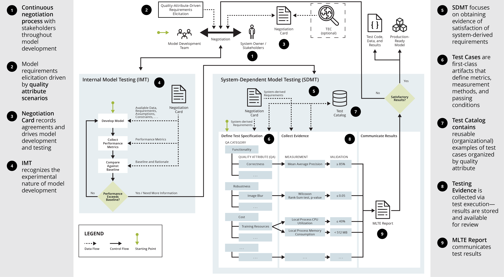

# Machine Learning Test and Evaluation (MLTE)


`MLTE` (pronounced "melt") is a process (framework) and toolset (Python package) for machine learning (ML) test and evaluation. `MLTE` enables teams to more effectively negotiate, document, and evaluate model qualities by offering a structured process including guided meetings (negotiations), testing infrastructure, and quality-attribute scenarios.



The `MLTE` process is detailed below, and following that are sections on [Further Information](#further-information) and [`MLTE` Metadata](#mlte-metadata).

# MLTE Process


## 1. Continuous Negotiation
The process starts with a negotiation step between model developers and project stakeholders where the goal is to share information about mission and system-derived requirements that will influence model development, such as the deployment environment, available data, and model requirements.

This negotiation continues throughout model development, in response to, for example, missing information, unrealistic expectations, and/or test results that do not meet system-derived requirements.

## 2. Quality Attribute Scenarios
Quality attributes are a way to specify a system’s structural and behavioral requirements; MLTE leverages this approach during negotiations to help teams move from vague requirements statements to concrete measurable requirements. More information on using quality attributes can be found by reading this <a href="https://arxiv.org/abs/2406.08575" target="_blank">paper</a>.

## 3. Negotiation Card
As part of the negotiation, teams fill out a `MLTE` [Negotiation Card](negotiation_card.md) which allows them to record agreements and drives model development and testing by providing a reference point across teams and skillsets.

## 4. Initial Model Testing (IMT)
IMT recognizes the iterative and experimental nature of model development. Teams use information from the [Negotiation Card](negotiation_card.md) during initial model development to inform model requirements, performance thresholds, and design decisions. Once initial development is complete, model teams perform preliminary testing to determine when the model exceeds baselines. Once model performance exceeds baselines, or if additional testing is needed to validate assumptions, the process moves to SDMT.

1. TRAINED MODEL: Performing IMT assumes that teams have a trained model. 

2. TEST MODEL USING `TESTSUITE`: Test the trained model against `TestCase`s selected during the negotiation with stakeholders during `MLTE` step ➀. 

3. DOES PERFORMANCE EXCEED BASELINE? 

    - YES: If performance exceeds the baseline, go to the next item in the `MLTE` workflow.
    
    - NO: If performance does not exceed the baseline, revisit the `MLTE` Negotiation Card to see if any of the items defined there need to change. After verifying model qualities via the Negotiation Card, retrain the model and then repeat IMT.

## 5. System Dependent Model Testing (SDMT)
In SDMT, teams focus on ensuring that the model fulfills the larger set of system and model requirements. To do so, teams conduct another negotiation or refer to the most recent touchpoint in their continuous negotiation to update the [Negotiation Card](negotiation_card.md). This prepares them to use system-derived requirements and quality attribute information to develop a `TestSuite`, which contains code that will evaluate each model or system-derived requirement.

## 6. Test Cases
`TestCase`s are artifacts that define metrics, measurement methods, and passing conditions. This allows teams to encode their requirements to be captured throughout the model development process.

## 7. Test Catalog
The `MLTE` [Test Catalog](test_catalog.md) contains reusable — local or organizational — examples of test cases sorted by quality attribute. Model developers can use the catalog to find examples of tests, similar to looking for code examples on StackOverflow. Model developers can also contribute test code back to the Test Catalog so that it can be used by others.

## 8. Testing Evidence
Artifacts are collected throughout the testing process when tests are executed, and then they are stored to provide a body of evidence that a model meets all its requirements. 

## 9. `MLTE` Report
Once test cases are executed, a `MLTE` Report can be generated to communicate test results and provide the context for requirements and results.

If stakeholders consider the results to be satisfactory, the outcome is a production-ready model (meaning that is meets defined system and model requirements), along with all testing evidence (code, data, and results). This evidence can be used for stakeholders to repeat tests, expand tests, or make decisions about additional testing effort required. An additional benefit is support for regression testing in response to model maintenance and evolution.

If stakeholders do not consider the results to be satisfactory, more negotiation is required to determine if requirements are realistic, whether more experimentation is required, or whether results triggered additional requirements or tests.

# Further Information

- [Using `MLTE`](using_mlte.md)
- [Development Environment](development.md)
- [`MLTE` Negotiation Card](negotiation_card.md)
- <a href="https://arxiv.org/abs/2303.01998" target="_blank">`MLTE` Paper</a> (ICSE 2023 - 45th International Conference on Software Engineering)
- <a href="https://doi.org/10.48550/arXiv.2406.08575" target="_blank">Using Quality Attribute Scenarios for ML Model Test Case Generation</a> (SAML 2024 - 3rd International Workshop on Software Architecture and Machine Learning)

# MLTE Metadata

- Version: 2.5.0
- Contact Email: mlte dot team dot info at gmail dot com
- Citations: While not required, it is highly encouraged and greatly appreciated if you cite our paper when you use `MLTE` for academic research.

```
    @inproceedings{maffey2023,
        title={MLTEing models: Negotiating, Evaluating, and Documenting
        Model and System Qualities},
        author={Maffey, Katherine R and Dotterrer, Kyle and Niemann,
        Jennifer and Cruickshank, Iain and Lewis, Grace A and 
        K{\"a}stner, Christian},
        booktitle={2023 IEEE/ACM 45th International Conference on 
        Software Engineering: New Ideas and Emerging Results 
        (ICSE-NIER)},
        pages={31--36},
        year={2023},
        organization={IEEE}
    }
```

... or if you use, or are inspired by, quality attributes for ML model test case generation.

```
    @inproceedings{brower2024,
        author={Brower-Sinning, Rachel and Lewis, Grace A. and Echeverría,
        Sebastián and Ozkaya, Ipek},
        booktitle={2024 IEEE 21st International Conference on Software
        Architecture Companion (ICSA-C)}, 
        title={Using Quality Attribute Scenarios for ML Model Test 
        Case Generation}, 
        year={2024},
        pages={307-310},
        organization={IEEE}
    }  
```

## Check out `MLTE` on <a href="https://github.com/mlte-team/mlte" target="_blank">GitHub</a>!