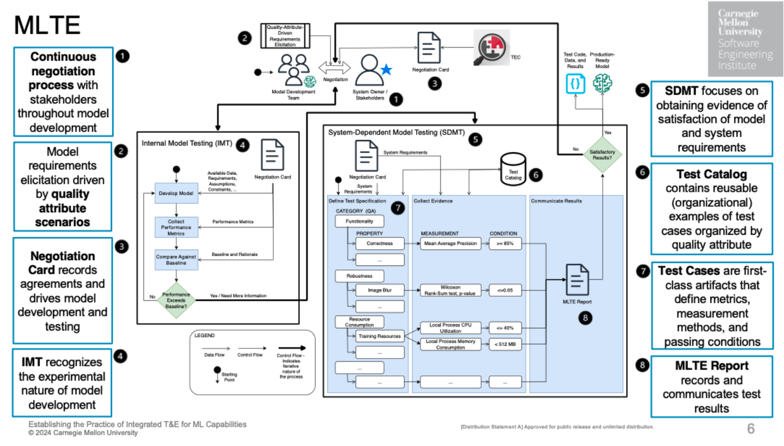

# MLTE Process

*Placeholder diagram*

## 1. Continuous Negotiation
The process starts with a negotiation step between model developers and project stakeholders where the goal is to share information about mission and system requirements that will influence model development, such as the deployment environment, available data, model requirements, and system requirements.

This negotiation continues throughout model development, in response (for example) to missing information, unrealistic expectations, and/or test results that do not meet system requirements,

### 2. Quality Attribute Scenarios
Quality attributes are a way to specify a system’s structural and behavioral requirements; MLTE leverages this approach during negotiations to help teams move from vague statements to concrete requirements. More information on using quality attributes can be found by reading this <a href="https://arxiv.org/abs/2406.08575" target="_blank">paper</a>.

### 3. Negotiation Card
As part of the negotiation, teams fill out a `MLTE` [negotiation card](negotiation_card.md) which allows them to record agreements and drives model development and testing.

## 4. Initial Model Testing (IMT)
Teams use information from the [negotiation card](negotiation_card.md) during initial model development to inform model requirements and thresholds. Once initial development is complete, model teams do initial testing during this step to determine when the model exceeds their baselines.

## 5. System Dependent Model Testing (SDMT)
Once a model passes its baseline requirements in IMT, teams can then focus on ensuring that it passes the larger set of system and model requirements. To do so, teams use system requirement and quality attribute information from the [negotiation card](negotiation_card.md) to develop a test specification, which contains code that will evaluate each model or system requirement.

### 6. Test Catalog
The `MLTE` Test Catalog contains reusable — local or organizational — examples of test cases organized by quality attribute. Model developers can use it to find examples of tests (like looking for code examples on StackOverflow). Model developers can also contribute test code back to the Test Catalog so that it can be used by others.

### 7. Test Cases
Test cases are derived from the test specification that defines metrics, measurement methods, and passing conditions.

### 8. `MLTE` Report
Once test cases are executed, a `MLTE` Report can be generated to communicate test results and provide the context for requirements and results.

If stakeholders consider the results to be satisfactory, the result is a production-ready model (meaning that is meets defined system and model requirements), along with all testing evidence (code, data, and results). This evidence can be used for stakeholders to repeat tests, expand tests, or make decisions about additional testing effort required. An additional benefit is support for regression testing in response to model maintenance and evolution.

If stakeholders do not consider the results to be satisfactory, more negotiation is required to determine if requirements are realistic, whether more experimentation is required, or whether results triggered additional requirements or tests.