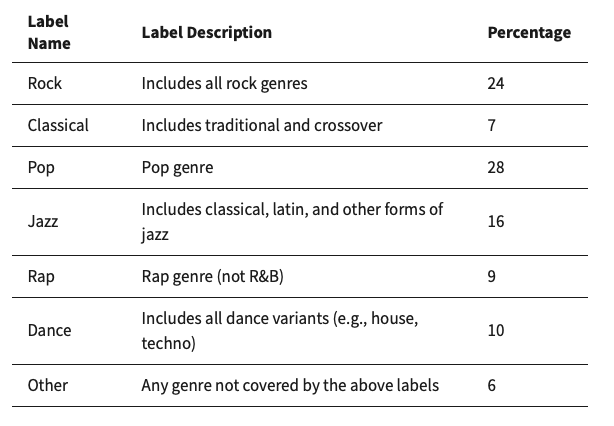
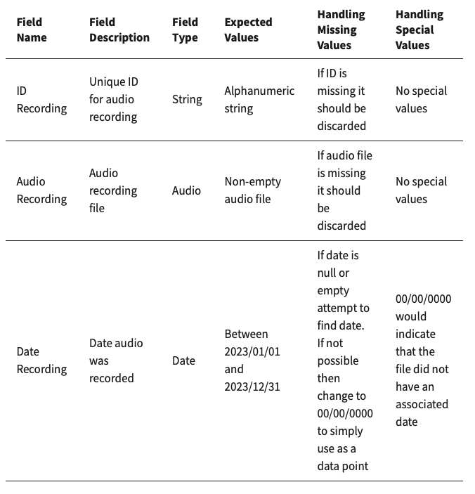

# MLTE Negotiation Card

## System Information

### Goals of the System

Goals or objectives that the model is going to help satisfy. For each goal, there can be one or more metrics to measure that goal, and every metric has a corresponding baseline.

*Example: Identify voice recordings that belong to a person of interest.*

#### Metric

For each goal, select a performance metric that captures the system's ability to accomplish that goal.

*Example: Accuracy above 90% on identifying voices.*

#### Baseline 

Select a baseline for each performance metric, which means a measurement that evaluates whether or not the model will/can achieve the main goal for which it is being created. If the goal cannot be measured directly, select a reasonable proxy and justify how that will reliably predict the model’s performance in achieving its goal.

*Example: Human accuracy for matching voices is ~60% as stated in the paper by Smith et al.*

### ML Problem Type 

Type of ML problem that the model is intended to solve.

*Example: Classification*

### ML Task 

Well-defined task that model is expected to perform, or problem that the model is expected to solve.

*Example: Identifying which voice recordings were spoken by the same person.*

### Usage Context

Who is intended to utilize the system/model; how the results of the model are going to be used by end users or in the context of a larger system.

*Example: Analyzing many recordings to determine which ones include a specific person of interest.*

### False Positive Risk 

What is the risk of producing a false positive?

*Example: Incorrect positive results will cause extra work for the analyts that needs to examine every recording flagged by the model.*

### False Negative Risk

What is the risk of producing a false negative?

*Example: Incorrect negative results means that the model will not flag suspicious recordings, so the analysts might miss information that is crucial to an investigation.*

### Other Risks of Producing Incorrect Results

What are the other risks of producing incorrect results?

## Data

Details of the data that will influence development efforts. Fill out the following fields for each dataset being used.

### Dataset Description

Short description of the dataset that will be used for model development.

*Example: Voice recordings from phone calls made to numbers in the 412 area code.*

### Source

Where is the data coming from, e.g., Enterprise Data, Public Data Source, Synthetic Data?

*Example: Company log data collected between Jan 1, 2023 and Dec 31, 2023.*

### Classification

What is the classification of the data?

*Example: Classified, Unclassified, Personal Health Information, etc.*

### Requirements and Constraints for Data Access

How will the data be accessed? What accounts are needed?

*Example: Data is stored on the "blue" server that requires an account on the "solid" network.*

### Labels and Distribution

List out all the labels for the data, along with the percentage of data they account for.

*Example:*

#### Labeling Method

Decribe the method used to label this dataset.

*Example: Hand labeled by a single domain expert.*

### Data Schema

Include relevant information that is known about the data; fill out all sections below for each data field. E.g., if there are four data fields, you would have four versions of the following descriptors, one for each data field.

#### Field Name: 
#### Field Description: 
#### Field Type: 
#### Expected Values: 
#### Missing Values: 
#### Special Values: 

*Example:*

### Data Rights

Are there particular ways in which the data can and cannot be used?

*Example: If classified data is being used, it must be stored on appropriately authorized equipment and networks.*

### Data Policies 

Are there policies that govern the data and its use, such as Personally Identifiable Information [PII]?

*Example: Post-analysis of audio recordings may associate them to a person and they would therefore become PII.*

## Model Information

### Development Compute Resources

Describe the amount and type of compute resources needed for training.

#### GPUs: 
#### CPUs: 
#### Memory: 
#### Storage: 

### Deployment Platform

Describe how the model will be integrated into the system; this likely includes descriptions of model deployment, application hosting, etc.

*Example: The model will be used on a local server as part of a closed network.*

### Capability Deployment Mechanism

Describe how the model capabilities will be made available, e.g., API, user facing, data feed.

*Example: The model will exposed an API so it can be called from the analyst UI.*

### Input Specification

Describe the input data type and format needed for model to conduct inference.

#### Input Name 

*Example: Audio recording*

#### Input Description 

Short input description.

*Example: Audio recording file for matching.*

#### Input Type

Field type, e.g., number, string, Boolean, video, image, etc.

*Example: Audio*

### Output Specification

Describe the output format and specification needed for the system to ingest model results.

#### Output Name 

*Example: Matching recordings*

#### Output Description 

Short output description.

*Example: Set of matching records from the database.*

#### Output Type

Field type, e.g., number, string, Boolean, video, image, etc.

*Example: Vector of strings with IDs of matching recordings - an empty vector means that there were no matches.*

### Production Compute Resources

Describe the amount and type of compute resources needed for inference.

#### GPUs: 
#### CPUs: 
#### Memory: 
#### Storage: 

## System Requirements

System-dependent requirements and constraints placed on the model under development. The fields below correspond to parts of a quality attribute scenario, which is a construct used to clearly define system requirements. Replicate the following format for each requirement or constraint, and use the filled out fields to create the requirement statement.

### System Quality

System property by which the model will be evaluated, e.g., accuracy, performance, robustness, fairness, resource consumption.

### Stimulus

A condition arriving at the system/model, e.g., data, event, user operation, attack, request for modification, completion of a unit of development.

### Source of Stimulus
Where the stimulus comes from, e.g., data source, internal/external user, internal/external computer system, sensor.

### Environment

Set of circumstances in which the scenario takes place, e.g., normal operations, overload condition, startup, development time.

### Response

Activity that occurs as a result of the arrival of the stimulus, e.g., inference, process event, deny access, implement modification, test.

### Response Measure

Measures used to determine that the responses enumerated for the scenario have been achieved, e.g., statistical property, latency, throughput, execution time, effort

### System Quality Statement

Scenario for {System Quality}: {Stimulus} from {Source} during {Environment}. {Response} {Response Measure}.

#### Example: Response Time

Scenario for response time:	Model receives an audio recording from analyst application during normal operations. Inference time	is at most 5 seconds.

#### Example: Fairness - Model Impartial to Photo Location

Scenario for fairness: Model receives a picture taken at the garden from flower identification application during normal operations. Correct identification of flowers regardless of garden location occurs at least 90% of the time.

#### Example: Robustness - Model Robust to Noise (Image Blur)

Scenario for robustness: Model receives a blurry picture taken at the garden from the flower identification application during normal operations. Correct identification of flowers occurs at the same rate as non-blurry images.

#### Example: Performance on Operational Platform

Scenario for performance: Model receives a picture taken at a garden from the flower identification application during normal operations. Model will need to run on the devices loaned out by the garden centers to visitors. These are small, inexpensive devices with limited CPU power, as well as limited memory and disk space (512 MB and 128 GB, respectively); there should be no errors due to unavailable resources.