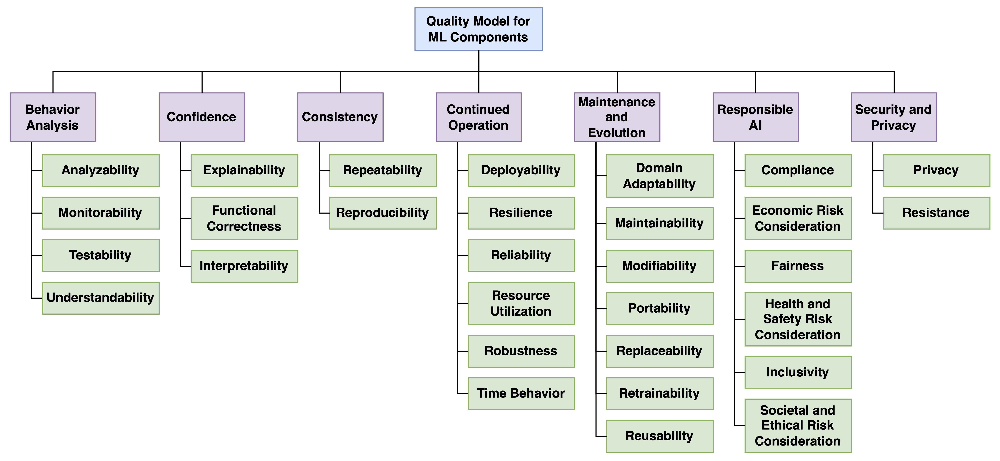

# Test Catalog

For many ML projects, testing is largely limited to model properties (such as model performance) without considering requirements derived from the system (i.e., throughput, resource consumption, or robustness). This limited view of testing leads to failures in model integration, deployment, and operations. 

To mitigate these testing shortcomings, `MLTE` is integrating a test catalog that contains reusable (local or organizational) examples of test cases sorted by quality attribute [see above diagram of the quality model].

This feature is under active development and more information will be made available upon release. Feel free to reach out to mlte dot team dot info at gmail dot com with any questions.